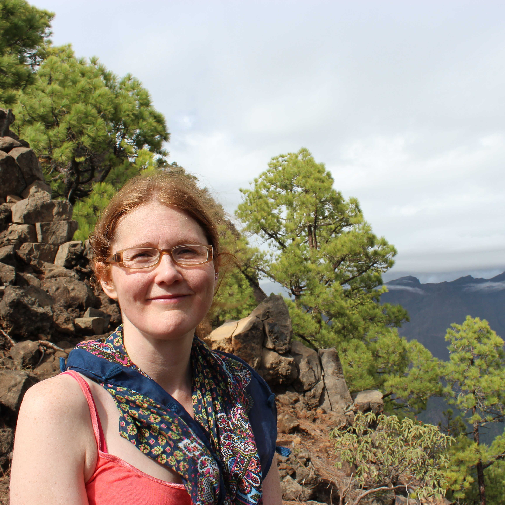
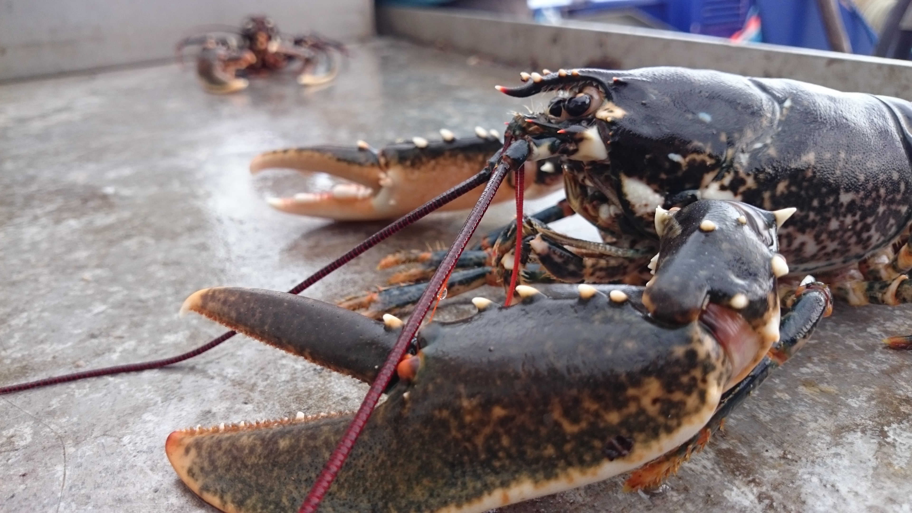

 
 
I am a quantitative ecologist that enjoys working with complex datasets to solve applied fisheries problems. My research is focussed on answering ecological questions that are relevant to stakeholders, by addressing knowledge gaps that are necessary to improve management decision-making. Many of my previous projects have been highly collaborative, involving stakeholders, regulators and industry. 

My research at the Department of Fisheries and Oceans is focussed on studying the movement, the behaviour and population of ecologically and commercially important benthic invertebrate species; snow crab (Chionoecetes opilio), American lobster (Homarus americanus), and rock crab (Cancer irroratus). 

My previous postdoc position at the University of Windsor used mark-recapture modeling to estimate Greenland halibut (Reinhardtius hippoglossoides) survival using deep-sea acoustic telemetry data and fish tags returned by Inuit fishers. These estimates will be used to support the development of an inshore Inuit community fishery within Cumberland Sound, Baffin Island. 

The aim of my PhD research was to better understand movement of free-ranging European lobsters (H. gammarus) in order to improve estimates of relative abundance, and improve the sustainability of European lobster stocks. I used fine-scale acoustic telemetry data to quantify individual behaviour of lobster in the presence and absence of traps, quantify the spatial overlap and dynamic interactions between lobsters, and investigate the environmental drivers of lobster movement.

  

 
