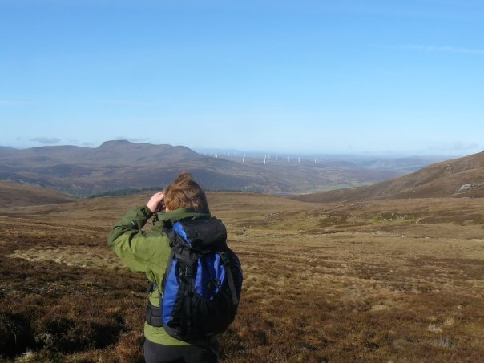

## Applied Ecology - Movement Ecology - Statistical modelling
<a href="https://twitter.com/Scottish_Bird" class="twitter-follow-button" data-show-count="false">Follow @Scottish_bird</a>

 

 

### Lobsters

       

 

### Seabirds

         

 

### Upland birds

